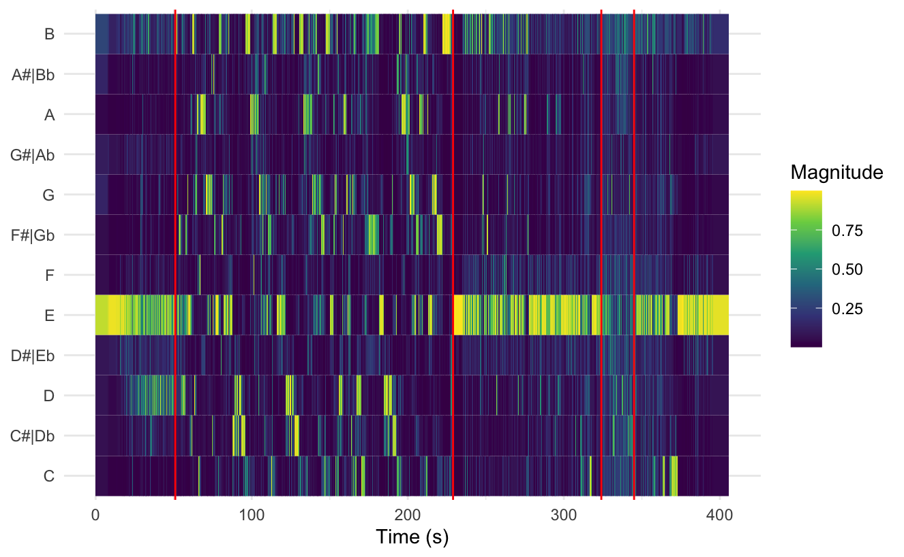
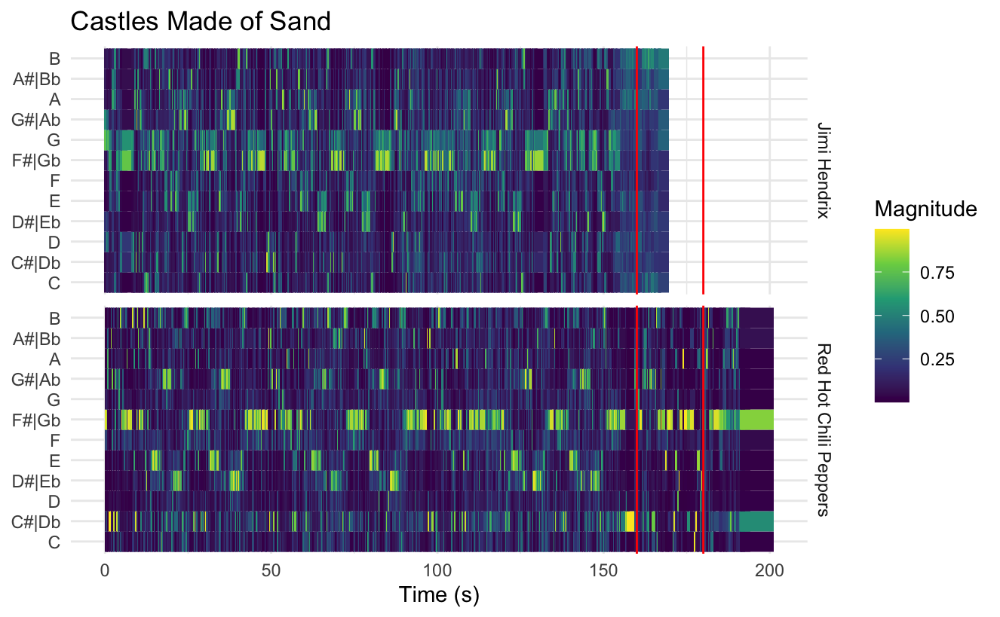
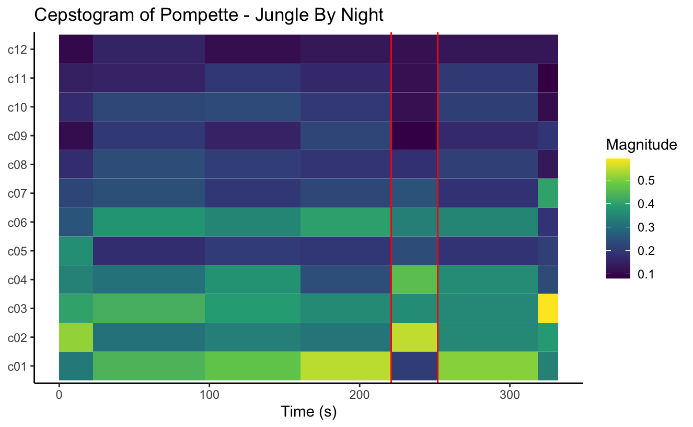
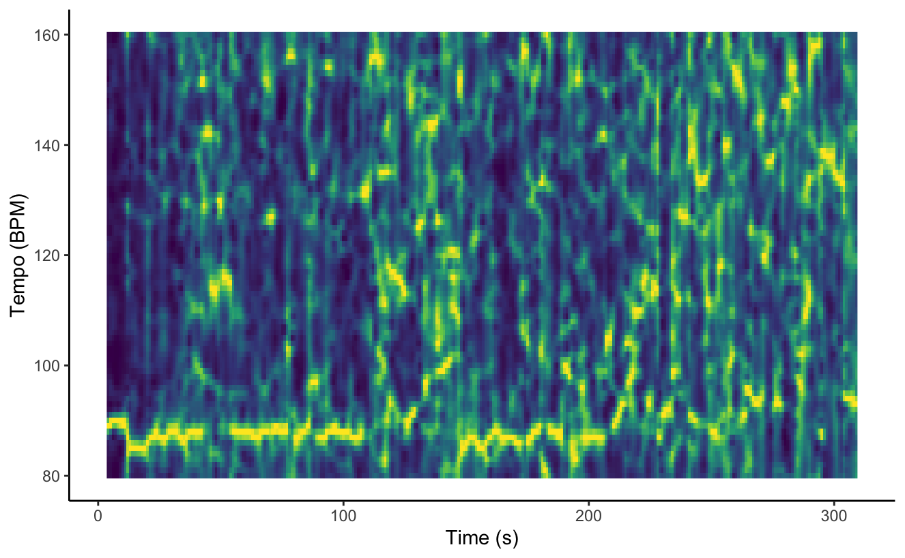
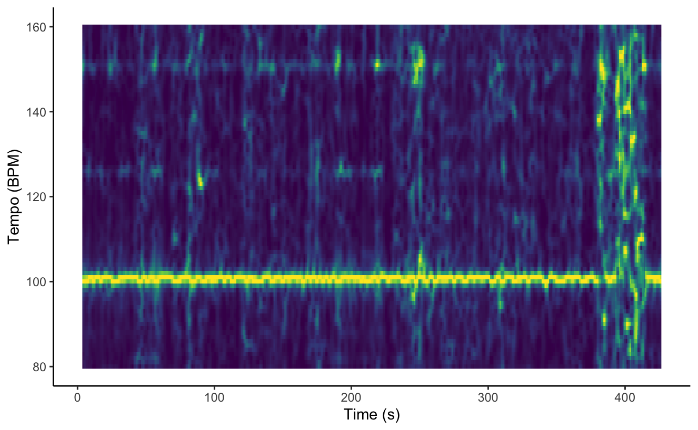
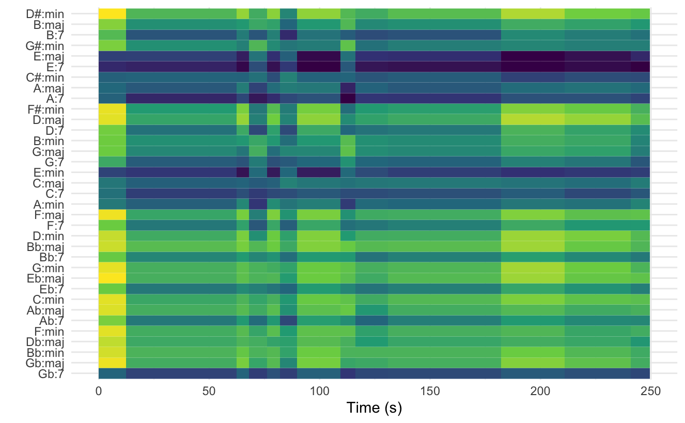
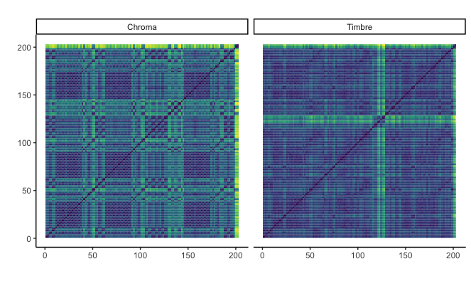
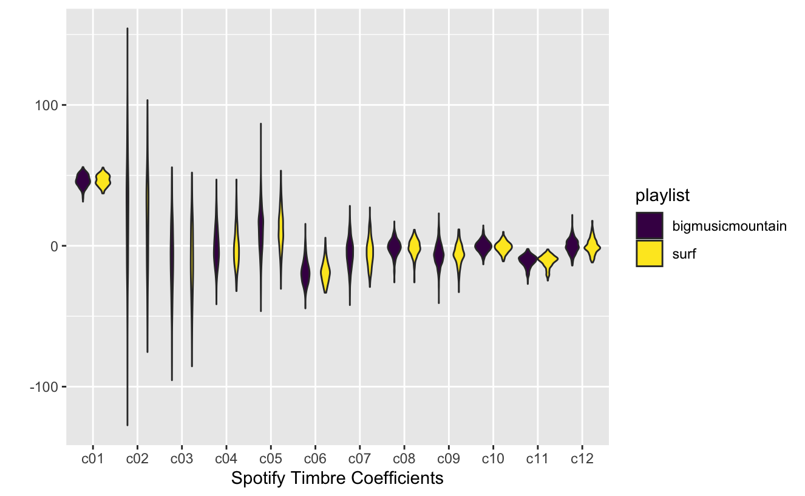

------------------------------------------------------------------------

```{r, setup}
library(tidyverse)
library(plotly)
library(spotifyr)
library(compmus)
library(flexdashboard)
library(kableExtra)
library(fmsb)

```

# Welcome to my portfolio!

**Welcome to my portfolio!**

For my corpus, i have chosen my own personal playlist: **Big Music Mountain**. It is basically a (\~600 song) playlist with the songs I like most across all genres. Basically every song I come across and really like is included in it. I chose this playlist as my corpus because it represents my own taste in music really well, and I hope to gain some insights into that by analyzing the Big Music Mountain.

The playlist mostly consists of my selection of good songs per album (or entire albums if all songs are good), so inside these albums there will be similarities, but across the albums there will be some differences. However, parts of the playlist are pretty similar (a Dire Straits album vs a Doors album will have quite some similarities).

Big Music Mountain mostly consists of:

-   **(Alternative / Psychedelic) Rock** (Jimi Hendrix, Parquet Courts, Red Hot Chili Peppers, Tame Impala)

-   **Indie** (Sticky Fingers, Mako Road, Dope Lemon, Jungle)

-   **Reggae** (Bob Marley, Billy Boyo, Eek-A-Mouse)

-   **Blues** (Dire Straits, The Doors, Tony Joe White)

-   **Country** (America, Canned Heat)

-   **Funk & R&B** (Curtis Mayfield, James Brown)

-   **Latin & African** (Manu Chao, Amanaz, William Onyeabor)

In this project I will review my own taste in music through the Spotify API and various other analysis tools, and hope to gain new insights into which types of music I like, and why I like them.

The playlist can be explored on the bottom of this page!

```{r, include=FALSE}
Sys.setenv(SPOTIFY_CLIENT_ID = 'e0b7bfdbe23340798ed4a387e11d1c33')
Sys.setenv(SPOTIFY_CLIENT_SECRET = '5aebd15afa39467fbf6e14ec48ce8fb7')

access_token <- get_spotify_access_token()

playlist_id <- "5WLcRUbX0ODQih9Fg2X5zG?si=02389b5f148b44e1"
playlist_data <- get_playlist(playlist_id)

bigmusicmountain <- 
  get_playlist_audio_features("", playlist_id) %>% 
  mutate(track.artists = map_chr(track.artists, \(x) x[1, "name"]))

```

------------------------------------------------------------------------

```{=html}
<iframe style="border-radius:12px" src="https://open.spotify.com/embed/playlist/5WLcRUbX0ODQih9Fg2X5zG?utm_source=generator" width="100%" height=100%" frameBorder="0" allowfullscreen="" allow="autoplay; clipboard-write; encrypted-media; fullscreen; picture-in-picture" loading="lazy"></iframe>
```
# Typical or Atypical? {.storyboard}

### How do we find the most typical and atypical songs for the Big Music Mountain playlist?

**What are the most typical and atypical songs in the Big Music Mountain playlist?**

My guess would be, because a large portion of the playlist are songs by Dire Straits, Red Hot Chili Peppers and Jimi Hendrix, that Castles Made of Sand is a pretty typical song in the list, as it is originally played by Jimi Hendrix, but covered by the Peppers. It sounds a little like a Dire Straits song too, and the text is in a similar style to that of the Dire Straits. Some very atypical songs are mostly 'guilty' pleasures, like Blue Monday and Young Guns by Wham.

However, this is all based on gut feeling, from which we can't really conclude facts. So how do we find typical and atypical songs in a playlist?

[Spotify keeps track of numerous features for every song on their platform,](https://developer.spotify.com/documentation/web-api/reference/#/operations/get-audio-features) which allows us to analyze the songs in our playlists! These features are:

-   **Acousticness**: A confidence measure from 0.0 to 1.0 of whether the track is acoustic. 1.0 represents high confidence the track is acoustic.

-   **Danceability** describes how suitable a track is for dancing based on a combination of musical elements including tempo, rhythm stability, beat strength, and overall regularity. A value of 0.0 is least danceable and 1.0 is most danceable.

-   **Energy**: Energy is a measure from 0.0 to 1.0 and represents a perceptual measure of intensity and activity. Typically, energetic tracks feel fast, loud, and noisy. For example, death metal has high energy, while a Bach prelude scores low on the scale. Perceptual features contributing to this attribute include dynamic range, perceived loudness, timbre, onset rate, and general entropy.

-   **Instrumentalness**: Predicts whether a track contains no vocals. "Ooh" and "aah" sounds are treated as instrumental in this context. Rap or spoken word tracks are clearly "vocal". The closer the instrumentalness value is to 1.0, the greater likelihood the track contains no vocal content. Values above 0.5 are intended to represent instrumental tracks, but confidence is higher as the value approaches 1.0.

-   **Key**: The key the track is in. Integers map to pitches using standard Pitch Class notation. E.g. 0 = C, 1 = C♯/D♭, 2 = D, and so on. If no key was detected, the value is -1.

-   **Liveness**: Detects the presence of an audience in the recording. Higher liveness values represent an increased probability that the track was performed live. A value above 0.8 provides strong likelihood that the track is live.

-   **Loudness**: The overall loudness of a track in decibels (dB). Loudness values are averaged across the entire track and are useful for comparing relative loudness of tracks. Loudness is the quality of a sound that is the primary psychological correlate of physical strength (amplitude). Values typically range between -60 and 0 db.

-   **Mode**: Mode indicates the modality (major or minor) of a track, the type of scale from which its melodic content is derived. Major is represented by 1 and minor is 0.

-   **Speechiness**: Speechiness detects the presence of spoken words in a track. The more exclusively speech-like the recording (e.g. talk show, audio book, poetry), the closer to 1.0 the attribute value. Values above 0.66 describe tracks that are probably made entirely of spoken words. Values between 0.33 and 0.66 describe tracks that may contain both music and speech, either in sections or layered, including such cases as rap music. Values below 0.33 most likely represent music and other non-speech-like tracks.

-   **Tempo**: The overall estimated tempo of a track in beats per minute (BPM). In musical terminology, tempo is the speed or pace of a given piece and derives directly from the average beat duration.

-   **Valence**: A measure from 0.0 to 1.0 describing the musical positiveness conveyed by a track. Tracks with high valence sound more positive (e.g. happy, cheerful, euphoric), while tracks with low valence sound more negative (e.g. sad, depressed, angry)

The first step will be to calculate what the average (mean) and median values of the Spotify features are for the entire playlist. This gives a good first look at what an average song for the Big Music Mountain sounds like to Spotify, based on the 11 features listed above. These features will be used a lot in this entire project, so it is good to understand them well!

The median and mean values of the features can be seen in the tables on the right hand side of this page.

------------------------------------------------------------------------

```{r}

# calculating medians
playlist_medians <- bigmusicmountain %>% 
  summarise(across(c(danceability, energy, key, loudness, mode, speechiness, 
                     acousticness, instrumentalness, liveness, valence, tempo), median))

playlist_medians_table <- playlist_medians %>%
  pivot_longer(everything(), names_to = "variable", values_to = "median") %>%
  arrange(variable)

# format median table
kable(playlist_medians_table, 
      col.names = c("Variable", "Median"), 
      align = "c", 
      caption = "Median Values for Music Attributes") %>% 
  kable_styling(full_width = F)

# calculating means
playlist_means <- bigmusicmountain %>% 
  summarise(across(c(danceability, energy, key, loudness, mode, speechiness, 
                     acousticness, instrumentalness, liveness, valence, tempo), mean))

playlist_means_table <- playlist_means %>%
  pivot_longer(everything(), names_to = "variable", values_to = "mean") %>%
  arrange(variable)

# format mean table
kable(playlist_means_table, 
      col.names = c("Variable", "Mean"), 
      align = "c", 
      caption = "Mean Values for Music Attributes") %>% 
  kable_styling(full_width = F)
```

### Violin plots

```{r plot, out.width = '80%', out.height = 'auto'}
# Reshape data to long format
music_data <- bigmusicmountain %>%
  pivot_longer(cols = c(danceability, energy, key, loudness, mode, speechiness, 
                        acousticness, instrumentalness, liveness, valence, tempo),
               names_to = "feature", 
               values_to = "value")

# Create violin plots for each feature
plots <- lapply(unique(music_data$feature), function(feature) {
  ggplot(data = music_data[music_data$feature == feature,], 
         aes(x = feature, y = value, fill = "#49adca")) +
    geom_violin(fill="#78c2ae") +
    labs(title = feature) +
    theme_minimal() +
    theme(legend.position = "none")
})

# Combine plots using cowplot package
library(cowplot)
plot_grid(plotlist = plots, ncol = 4, align = "hv")
```

------------------------------------------------------------------------

In order to visualize the distribution of features in the Big Music Mountain playlist, I have made a violin plot for each feature, in which the distribution of values can be seen. In a violin plot, the width of the body at a certain point is relative to how often that value is found in the data.

Let's walk through a few of these plots to get a better idea of the distribution of feature values in the Big Music Mountain!

-   **Danceability**, **valence**, **loudness** and **energy**: In each of these plots, we see that they are somewhat similar to each other, which is logical because these features are dependent on one another. We can see that overall, songs in the playlist are quite danceable, often positive, have high energy and are quite loud.

-   **Acousticness**, **instrumentalness** and **speechiness**: In these plots we see a thin body at the top, and a broad body at the bottom, meaning that songs in the playlist aren't often acoustic, instrumental or 'speechy'. We can also see that these features are somewhat correlated to each other, which makes sense too, since acoustic songs are often instrumental too.

-   **Key** & **Mode**: These plots don't really give us valuable information, only that mode is quite uniformly distributed between 0 and 1, with a slight tendency towards 1 (major). Key has a broad body in most places, except for key 3 (D# / Eb), which actually corresponds to the [least common key in music](https://www.jmlmusic.no/blog/most-popular-keys-in-songwriting), which interestingly also is D# / Eb.

The next step in our process of finding the most (a)typical song in the Big Music Mountain playlist is to find out which song's features are the closest to the median values.

### Which songs are the most typical and atypical for the Big Music Mountain playlist?

**Which songs are the most typical and atypical for the Big Music Mountain playlist?**

To find which song is most typical for the Big Music Mountain, and therefore also for my taste in music, I have calculated the Euclidean distance from each song's features to the median value for that feature, and added these up. Then the smallest distance can be read off for the most typical song, and the highest distance for the most atypical song. I have made a top 3 for typical and atypical songs.

I have chosen to only include the variables which range from 0-1, because a variable like tempo can range from (e.g.) 60 to 180, and therefore weigh in much stronger. I have tried scaling the variables that don't range from 0-1, but found that the results were less accurate to my actual music taste.

Here is what I have found!

+---------------------------------------------------------------------------------------------------------------------------------------------------------------------------------------------------------------------------------------------------------------------------------------------------+---------------------------------------------------------------------------------------------------------------------------------------------------------------------------------------------------------------------------------------------------------------------------------------------------+
| Most typical songs:                                                                                                                                                                                                                                                                               | Most atypical songs:                                                                                                                                                                                                                                                                              |
+:=================================================================================================================================================================================================================================================================================================:+:=================================================================================================================================================================================================================================================================================================:+
| 1\. In The Gallery - Dire Straits                                                                                                                                                                                                                                                                 | 1\. Private Investigations - Dire Straits                                                                                                                                                                                                                                                         |
|                                                                                                                                                                                                                                                                                                   |                                                                                                                                                                                                                                                                                                   |
| ```{=html}                                                                                                                                                                                                                                                                                        | ```{=html}                                                                                                                                                                                                                                                                                        |
| <iframe style="border-radius:12px" src="https://open.spotify.com/embed/track/5SXemxLERs0imkLpe4Aq8v?utm_source=generator" width="80%" height="100" frameBorder="0" allowfullscreen="" allow="autoplay; clipboard-write; encrypted-media; fullscreen; picture-in-picture" loading="lazy"></iframe> | <iframe style="border-radius:12px" src="https://open.spotify.com/embed/track/5KVak7r5YKcnkmARc0hy0Q?utm_source=generator" width="80%" height="100" frameBorder="0" allowfullscreen="" allow="autoplay; clipboard-write; encrypted-media; fullscreen; picture-in-picture" loading="lazy"></iframe> |
| ```                                                                                                                                                                                                                                                                                               | ```                                                                                                                                                                                                                                                                                               |
+---------------------------------------------------------------------------------------------------------------------------------------------------------------------------------------------------------------------------------------------------------------------------------------------------+---------------------------------------------------------------------------------------------------------------------------------------------------------------------------------------------------------------------------------------------------------------------------------------------------+
| 2\. Money For Nothing - Dire Straits                                                                                                                                                                                                                                                              | 2\. Green Onions - Booker T. & The M.G.'s                                                                                                                                                                                                                                                         |
|                                                                                                                                                                                                                                                                                                   |                                                                                                                                                                                                                                                                                                   |
| ```{=html}                                                                                                                                                                                                                                                                                        | ```{=html}                                                                                                                                                                                                                                                                                        |
| <iframe style="border-radius:12px" src="https://open.spotify.com/embed/track/4bO6DljpuAeQh6HS20i0I5?utm_source=generator" width="80%" height="100" frameBorder="0" allowfullscreen="" allow="autoplay; clipboard-write; encrypted-media; fullscreen; picture-in-picture" loading="lazy"></iframe> | <iframe style="border-radius:12px" src="https://open.spotify.com/embed/track/4fQMGlCawbTkH9yPPZ49kP?utm_source=generator" width="80%" height="100" frameBorder="0" allowfullscreen="" allow="autoplay; clipboard-write; encrypted-media; fullscreen; picture-in-picture" loading="lazy"></iframe> |
| ```                                                                                                                                                                                                                                                                                               | ```                                                                                                                                                                                                                                                                                               |
+---------------------------------------------------------------------------------------------------------------------------------------------------------------------------------------------------------------------------------------------------------------------------------------------------+---------------------------------------------------------------------------------------------------------------------------------------------------------------------------------------------------------------------------------------------------------------------------------------------------+
| 3\. One of These Nights - Eagles                                                                                                                                                                                                                                                                  | 3\. Brothers In Arms - Dire Straits                                                                                                                                                                                                                                                               |
|                                                                                                                                                                                                                                                                                                   |                                                                                                                                                                                                                                                                                                   |
| ```{=html}                                                                                                                                                                                                                                                                                        | ```{=html}                                                                                                                                                                                                                                                                                        |
| <iframe style="border-radius:12px" src="https://open.spotify.com/embed/track/608xszaAxVh4m7NcKJiAbF?utm_source=generator" width="80%" height="100" frameBorder="0" allowfullscreen="" allow="autoplay; clipboard-write; encrypted-media; fullscreen; picture-in-picture" loading="lazy"></iframe> | <iframe style="border-radius:12px" src="https://open.spotify.com/embed/track/60bF2b61f7Q5Bt82QCBwvc?utm_source=generator" width="80%" height="100" frameBorder="0" allowfullscreen="" allow="autoplay; clipboard-write; encrypted-media; fullscreen; picture-in-picture" loading="lazy"></iframe> |
| ```                                                                                                                                                                                                                                                                                               | ```                                                                                                                                                                                                                                                                                               |
+---------------------------------------------------------------------------------------------------------------------------------------------------------------------------------------------------------------------------------------------------------------------------------------------------+---------------------------------------------------------------------------------------------------------------------------------------------------------------------------------------------------------------------------------------------------------------------------------------------------+

```{r}

# Calculate Euclidean distance for each song
bigmusicmountain_dist <- bigmusicmountain %>% 
  mutate(dist = sqrt((danceability - playlist_medians$danceability)^2 +
                       (energy - playlist_medians$energy)^2 +
                       (speechiness - playlist_medians$speechiness)^2 +
                       (acousticness - playlist_medians$acousticness)^2 +
                       (instrumentalness - playlist_medians$instrumentalness)^2 +
                       (liveness - playlist_medians$liveness)^2 +
                       (valence - playlist_medians$valence)^2))

# Sort by distance and select first row (i.e., song with smallest distance)
most_average_songs <- bigmusicmountain_dist %>% 
  arrange(dist) %>% 
  slice(1:3)


least_average_songs <- bigmusicmountain_dist %>% 
  arrange(-dist) %>% 
  slice(1:3)


```

### Analysis (a)typical songs

```{r}
privateinvest <- get_track_audio_features("5KVak7r5YKcnkmARc0hy0Q")
brothersinarms <- get_track_audio_features("60bF2b61f7Q5Bt82QCBwvc")
greenonions <- get_track_audio_features("4fQMGlCawbTkH9yPPZ49kP")

inthegallery <- get_track_audio_features("5SXemxLERs0imkLpe4Aq8v")
moneyfornothing <- get_track_audio_features("4bO6DljpuAeQh6HS20i0I5")
oneofthesenights <- get_track_audio_features("608xszaAxVh4m7NcKJiAbF")


# Reshape data to long format
music_data1 <- bigmusicmountain %>%
  pivot_longer(cols = c(danceability, energy, speechiness, 
                        acousticness, instrumentalness, liveness, valence),
               names_to = "feature", 
               values_to = "value")

# filter data to only include relevant audio features and songs
most_least_data <- music_data1 %>%
  filter(track.id %in% c(most_average_songs$track.id, least_average_songs$track.id))


# create a new data frame with the median values for each audio feature
median_data <- playlist_medians_table %>%
  filter(variable %in% c("danceability", "instrumentalness", "valence", "energy", "speechiness", "acousticness", "liveness")) %>%
  rename(feature = variable, value = median)


# plot the data with the median values added
a <- ggplot(most_least_data, aes(x = feature, y = value, color = track.name)) +
  geom_point(size = 3) +
  geom_point(data = median_data, aes(x = feature, y = value), color = "black", size = 3, shape = 21, fill = "white") +
  scale_color_discrete(name = "Song") +
  labs(x = "", y = "Value", title = "Audio Features for Most and Least Average Songs") +
  theme_minimal() +
  theme(legend.position = "bottom")

ggplotly(a)
```

------------------------------------------------------------------------

Let's have a closer look at the most typical and atypical songs in the playlist. As we can see, actually most of the songs in both the typical and atypical songs are from Dire Straits, which is interesting because it shows they have a wide variety of songs in very different styles. The atypical songs **Private Investigations** and **Brothers In Arms** are probably atypical because they are both very long, slow, mostly instrumental songs.

In this plot, we see the values of each audio feature (the ones that range from 0-1 to keep the scales from getting out of hand) for the top 3 typical songs for the Big Music Mountain, and the top 3 atypical songs. The (black-surrounded) white dots represent the median values for each feature.

\
Firstly, for the typical songs **In The Gallery, One Of These Nights** and **Money For Nothing** we can see that the audio features are quite average, around the median values for the features, whereas the atypical songs **Brothers In Arms, Private Investigations** and **Green Onions** have a much greater distance to the median. If we take valence as an example, we see that Brothers In Arms and Private Investigations fall in the same category of low valence songs, whereas Green Onions is an outlier in the sense that it's valence is extremely high.

An interesting thing to point out is that Brothers In Arms is actually my favorite song of all time (Private Investigations is also up there), while it shows up as one of the most atypical songs in my playlist, so the most typical song in your playlist doesn't have to be your favorite song (the contrary in my case!).

------------------------------------------------------------------------

# -ograms and matrices {.storyboard}

### Chromagrams: Private Investigations - Dire Straits

```{r}
#wood <-
#  get_tidy_audio_analysis("5KVak7r5YKcnkmARc0hy0Q?si=f1a0307cd2cf4b49") |>
#  select(segments) |>
#  unnest(segments) |>
#  select(start, duration, pitches)

#wood |>
#  mutate(pitches = map(pitches, compmus_normalise, "euclidean")) |>
#  compmus_gather_chroma() |> 
#  ggplot(
#    aes(
#      x = start + duration / 2,
#      width = duration,
#      y = pitch_class,
#      fill = value
#    )
#  ) +
#  geom_tile() +
#  geom_vline(xintercept = c(51, 229), color = "red") +
#  geom_vline(xintercept = c(324, 345), color = "red") +
#  labs(x = "Time (s)", y = NULL, fill = "Magnitude") +
#  theme_minimal() +
#  scale_fill_viridis_c()

```

```{=html}
<center></center>
```
```{=html}
<center><iframe style="border-radius:12px" src="https://open.spotify.com/embed/track/5KVak7r5YKcnkmARc0hy0Q?utm_source=generator" width="50%" height="200" frameBorder="0" allowfullscreen="" allow="autoplay; clipboard-write; encrypted-media; fullscreen; picture-in-picture" loading="lazy"></iframe></center>
```

------------------------------------------------------------------------

A chromagram provides a way to visualize the presence of different musical notes in an audio signal, in which the magnitude of the presence of each note is indicated with yellower shades. It basically shows you which notes are present in each part of a song, in which these parts can be split up in different segments, sections or bars.

The chromagram pictured here is that of Private Investigations by Dire Straits which, as we saw from my previous analysis, was one of the most atypical songs in my playlist and therefore an interesting outlier to analyse. Before we dive into the chromagram, I will provide a little background on the song itself.

Private Investigations is a rock song, released by (one of my favorite bands) Dire Straits in 1982, from the album Love Over Gold. It is a long song (6:45), in which the beginning is very quiet and soft, after which it slowly gets more intense as more instruments are added, such as (bass) guitar, drums, piano and synthesizers.

Let's look at the chromagram now! I have marked several sections in the chromagram that are interesting to look at more closely.

-   **Section 1** (0:00-0:51): This is the introduction of the song. It is a gentle piano part with a dark synthesizer sound playing a single note in the background. We can see from the chromagram that this note is E. The sporadic piano notes can be seen as greenish shades in the plot.

-   **Section 2** (0:51-3:49): This is the middle part of the song, in which more instruments slowly start playing, and vocals come in. It starts with an acoustic guitar playing the song's theme once and then more instruments start following this theme. We can see that a theme is repeated several times from the chromagram; especially B, A, G, D and C# are played alternatingly during this part, which are notes from the B minor scale, coinciding with the key of the song.

-   **Section 3** (3:49-5:24): After the middle part, the instrumental theme ends with a loud bass E note, repeating slowly throughout the section as more instruments play sporadic themes. This section looks really similar to the first section, except that it has more small different notes, which are the acoustic and electric guitar, along with some other instruments.

-   **Section 4** (5:24-5:45): This section is a little special, because the chromagram doesn't really tell us which notes are present, it looks like all of them are somewhat present, but with low magnitudes. This is because this part is actually quiet, with only a few percussion instruments playing very softly. Percussion instruments usually play a sound that includes a lot of frequencies, so they tend to show up across all notes in a chromagram.

-   **Section 5** (5:45-6:45): This is the outro, which once again is very similar to the introduction and third part. The same instruments are playing, and the song slowly fades to an end over a low E bass note.

### Chromagrams: Castles Made Of Sand - Jimi Hendrix / Red Hot Chili Peppers

```{=html}
<center><iframe style="border-radius:12px" src="https://open.spotify.com/embed/playlist/3pqFE3RGj0ZVc4llJz5Nmr?utm_source=generator" width="80%" height="352" frameBorder="0" allowfullscreen="" allow="autoplay; clipboard-write; encrypted-media; fullscreen; picture-in-picture" loading="lazy"></iframe></center>
```
.

.

.

```{=html}
<center></center>
```

------------------------------------------------------------------------

Another interesting song in my corpus is Castles Made Of Sand, because this is the only song that occurs twice in the Big Music Mountain. The original version is by Jimi Hendrix, recorded in 1967, and the Red Hot Chili Peppers covered it as a bonus track in their album Blood Sugar Sex Magik in 1991. The Chili Peppers album actually has another Jimi Hendrix cover; Little Miss Lover. The guitarist of the Red Hot Chili Peppers, [John Frusciante, is greatly influenced by Jimi Hendrix](https://faroutmagazine.co.uk/john-frusciante-explains-why-jimi-hendrix-is-the-greatest-guitarist-of-all-time/) (calling him the greatest guitar player of all time), which is recognizable if you listen to both of their songs. They have very similar styles of guitar playing.

I have made a chromagram of both songs to analyse what similarities and differences they have.

In the Red Hot Chili Peppers cover version, the song is slowed down a bit in respect to Jimi's version, which we can see by the chromagram being a bit longer. There is one point in the song though (marked with the red bars) where the Chili Peppers speed up a lot for around 20 seconds, which is visible in the chromagram by the shorter intervals of the yellow bars.

The second thing that appeared to me was that it isn't entirely clear which key the Jimi Hendrix version is in. It looks like either G or F#, whereas the Chili Peppers version is clearly in F#. Jimi Hendrix famously tuned his guitar a half step down, so instead of the standard tuning E A D G B E, he often used Eb Ab Db Gb Bb Eb. I know from the guitar chords that the song is in F#, so I assume the recording quality of Jimi's version is a little lower, resulting in less clearly emphasised notes, or Jimi simply didn't tune his guitar too well. The Red Hot Chili peppers version has a 20+ year advantage on production technology, so sounds more compressed and clear.

The same chord progression can be seen in both songs, with a strong emphasis on the notes F#, G#, E, Eb and C#.

Whereas in Jimi's version, the ending doesn't have emphasis on specific notes, we see in the Peppers' version that the chromagram very clearly displays the key Gb, along with some C#. They actually play the same outro, but Jimi's version has more feedback, which probably caused it to smear out the frequencies across all notes.

### Cepstrogram: Timbre feature analysis of Pompette - Jungle By Night.

```{=html}
<center></center>
```
.

.

```{=html}
<center><iframe style="border-radius:12px" src="https://open.spotify.com/embed/track/0eOBMq9SIuDtkvKLA873pu?utm_source=generator" width="50%" height="200" frameBorder="0" allowfullscreen="" allow="autoplay; clipboard-write; encrypted-media; fullscreen; picture-in-picture" loading="lazy"></iframe></center>
```

------------------------------------------------------------------------

A **cepstrogram** is a different kind of audio-analysis visualisation, in which timbre features are plotted over time. These features aren't really well known, but we know that the c01 coefficient corresponds to loudness, c02 to bright tones, c03 to mid range tones. After this the coefficients get a little hard to put into words. In this case I have chosen to split the time steps up in sections.

In this plot we see the cepstrogram of Pompette, by Dutch band Jungle By Night. It is an instrumental song with [a lot of different instruments](https://junglebynight.com/about/). We see that a lot of the timbre coefficients are present in this song, which is most likely due to the large amount of instruments with different timbre, all producing very different sounds.

There is one very interesting part of the cepstrogram, from around 220-250 seconds, in which we see most the most present timbre coefficient jump from c01 to c02. c01 corresponds with loudness and in this part there is a somewhat quiet percussion solo, explaining why the c01 coefficient is less present here. The c02 coefficient corresponding to bright tones is clear here, as the percussion instrument plays a high tone.

The outro of the song is a synthesizer playing a scale repeatedly, which also causes the timbre coefficients to switch up a bit.

### Tempograms: Difference between the tempograms of the most and least danceable songs.

```{=html}
<div style="display: flex; flex-direction: column;">
  <center></center>
  <center><iframe style="border-radius:12px" src="https://open.spotify.com/embed/track/2AxCeJ6PSsBYiTckM0HLY7?utm_source=generator" width="30%" height="100" frameBorder="0" allowfullscreen="" allow="autoplay; clipboard-write; encrypted-media; fullscreen; picture-in-picture" loading="lazy"></iframe></center>
  <center></center>
  <center><iframe style="border-radius:12px" src="https://open.spotify.com/embed/track/5isA9icHWl2651hvfr1EOV?utm_source=generator" width="30%" height="100" frameBorder="0" allowfullscreen="" allow="autoplay; clipboard-write; encrypted-media; fullscreen; picture-in-picture" loading="lazy"></iframe></center>
  
</div>
```

------------------------------------------------------------------------

An idea that came to me was if I could see which song is the least danceable v.s. the song that is most danceable, and compare the two tempograms of them. Because beat/tempo consistency is a part of the danceability feature, I would expect the most danceable song to have a high beat consistency (visible in a tempogram as a horizontal line), whereas the least danceable song is expected to have a lot of tempo variation.

I have decided to take the top 3 most and least danceable songs and to take the most interesting one out of each one.

Let's look at the two songs!

-   **Least danceable song:** Voodoo Child (Slight Return) - Jimi Hendrix

-   **Most danceable song:** The Message - Grandmaster Flash & The Furious Five

At a glance you can immediately see that the tempograms are very different from each other; the tempogram of **The Message** is very consistent around 100 BPM, whereas **Voodoo Child**'s tempogram is all over the place, with no clear line through it.

This is actually quite logical if we look at the definition of the danceability feature: "*Danceability describes how suitable a track is for dancing based on a combination of musical elements including tempo, rhythm stability, beat strength, and overall regularity. A value of 0.0 is least danceable and 1.0 is most danceable.*" The tempo in **The Message** is very stable and regular and has a tempo of 101 BPM, which is very close to [the most danceable tempo, which is 100 bpm.](https://socialdance.stanford.edu/Syllabi/DJtips.htm)

When we look at the least danceable track **Voodoo Child**, we see that it doesn't have a stable tempo, which is most likely due to it being a very old track (little to no pre-processing) in which the drummer probably follows Jimi Hendrix his guitar playing which can be all over the place sometimes. The track sounds more like a jam, in which it's hard to stick to a certain tempo. I do believe the generated tempogram doesn't accurately capture the tempo for this song, in reality the song is centered around 88 BPM and deviates a little from this throughout the track.

I would say that danceability is an important factor when it comes to my personal taste in music. I tend to gravitate towards music that has a strong beat and rhythm (higher danceability), which is reflected in the median danceability being 0.65.

### Chordogram

.

.

```{=html}
<center><iframe style="border-radius:12px" src="https://open.spotify.com/embed/track/2Sjez1CwJv8Pz018CxKjWa?utm_source=generator" width="75%" height="300" frameBorder="0" allowfullscreen="" allow="autoplay; clipboard-write; encrypted-media; fullscreen; picture-in-picture" loading="lazy"></iframe></center>
```
```{=html}
<center></center>
```
```{r}
# circshift <- function(v, n) {
#   if (n == 0) v else c(tail(v, n), head(v, -n))
# }
# 
# #      C     C#    D     Eb    E     F     F#    G     Ab    A     Bb    B
# major_chord <-
#   c(   1,    0,    0,    0,    1,    0,    0,    1,    0,    0,    0,    0)
# minor_chord <-
#   c(   1,    0,    0,    1,    0,    0,    0,    1,    0,    0,    0,    0)
# seventh_chord <-
#   c(   1,    0,    0,    0,    1,    0,    0,    1,    0,    0,    1,    0)
# 
# major_key <-
#   c(6.35, 2.23, 3.48, 2.33, 4.38, 4.09, 2.52, 5.19, 2.39, 3.66, 2.29, 2.88)
# minor_key <-
#   c(6.33, 2.68, 3.52, 5.38, 2.60, 3.53, 2.54, 4.75, 3.98, 2.69, 3.34, 3.17)
# 
# chord_templates <-
#   tribble(
#     ~name, ~template,
#     "Gb:7", circshift(seventh_chord, 6),
#     "Gb:maj", circshift(major_chord, 6),
#     "Bb:min", circshift(minor_chord, 10),
#     "Db:maj", circshift(major_chord, 1),
#     "F:min", circshift(minor_chord, 5),
#     "Ab:7", circshift(seventh_chord, 8),
#     "Ab:maj", circshift(major_chord, 8),
#     "C:min", circshift(minor_chord, 0),
#     "Eb:7", circshift(seventh_chord, 3),
#     "Eb:maj", circshift(major_chord, 3),
#     "G:min", circshift(minor_chord, 7),
#     "Bb:7", circshift(seventh_chord, 10),
#     "Bb:maj", circshift(major_chord, 10),
#     "D:min", circshift(minor_chord, 2),
#     "F:7", circshift(seventh_chord, 5),
#     "F:maj", circshift(major_chord, 5),
#     "A:min", circshift(minor_chord, 9),
#     "C:7", circshift(seventh_chord, 0),
#     "C:maj", circshift(major_chord, 0),
#     "E:min", circshift(minor_chord, 4),
#     "G:7", circshift(seventh_chord, 7),
#     "G:maj", circshift(major_chord, 7),
#     "B:min", circshift(minor_chord, 11),
#     "D:7", circshift(seventh_chord, 2),
#     "D:maj", circshift(major_chord, 2),
#     "F#:min", circshift(minor_chord, 6),
#     "A:7", circshift(seventh_chord, 9),
#     "A:maj", circshift(major_chord, 9),
#     "C#:min", circshift(minor_chord, 1),
#     "E:7", circshift(seventh_chord, 4),
#     "E:maj", circshift(major_chord, 4),
#     "G#:min", circshift(minor_chord, 8),
#     "B:7", circshift(seventh_chord, 11),
#     "B:maj", circshift(major_chord, 11),
#     "D#:min", circshift(minor_chord, 3)
#   )
# 
# key_templates <-
#   tribble(
#     ~name, ~template,
#     "Gb:maj", circshift(major_key, 6),
#     "Bb:min", circshift(minor_key, 10),
#     "Db:maj", circshift(major_key, 1),
#     "F:min", circshift(minor_key, 5),
#     "Ab:maj", circshift(major_key, 8),
#     "C:min", circshift(minor_key, 0),
#     "Eb:maj", circshift(major_key, 3),
#     "G:min", circshift(minor_key, 7),
#     "Bb:maj", circshift(major_key, 10),
#     "D:min", circshift(minor_key, 2),
#     "F:maj", circshift(major_key, 5),
#     "A:min", circshift(minor_key, 9),
#     "C:maj", circshift(major_key, 0),
#     "E:min", circshift(minor_key, 4),
#     "G:maj", circshift(major_key, 7),
#     "B:min", circshift(minor_key, 11),
#     "D:maj", circshift(major_key, 2),
#     "F#:min", circshift(minor_key, 6),
#     "A:maj", circshift(major_key, 9),
#     "C#:min", circshift(minor_key, 1),
#     "E:maj", circshift(major_key, 4),
#     "G#:min", circshift(minor_key, 8),
#     "B:maj", circshift(major_key, 11),
#     "D#:min", circshift(minor_key, 3)
#   )
# 
# outoftime <-
#   get_tidy_audio_analysis("2Sjez1CwJv8Pz018CxKjWa") |>
#   compmus_align(sections, segments) |>
#   select(sections) |>
#   unnest(sections) |>
#   mutate(
#     pitches =
#       map(segments,
#         compmus_summarise, pitches,
#         method = "mean", norm = "manhattan"
#       )
#   )
# 
# outoftime |> 
#   compmus_match_pitch_template(
#     chord_templates,         # Change to chord_templates if descired
#     method = "euclidean",  # Try different distance metrics
#     norm = "manhattan"     # Try different norms
#   ) |>
#   ggplot(
#     aes(x = start + duration / 2, width = duration, y = name, fill = d)
#   ) +
#   geom_tile() +
#   scale_fill_viridis_c(guide = "none") +
#   theme_minimal() +
#   labs(x = "Time (s)", y = "")
# 

```

------------------------------------------------------------------------

A chordogram is a way to visualise which chord is being played at a certain moment. This is the chordogram of **Cars Hiss by My Window** by **The Doors**. It is a bluesy slow song, with 3 main simple chords.

This song is a perfect example of a I-IV-V blues chord progression, which we can see in the chordogram. The simplicity of the I-IV-V progression allows for a lot of room for improvisation and soloing, which is a key element of blues music. The I-IV-V progression is often used in a 12-bar blues format, which consists of three lines of four bars each, which is the case for this song too.

We see that the main present chord is an E7. The Em chord is also present a lot, but this is due to the Em chord containing all the notes that an E7 has too. The song mainly alternates between E7 (I) and A7 (IV), and moves to a B7 (V) before a turnaround brings it back to E7.

The last part of the song is mostly improvised over a simpler variant of the progression, which we see indicated by the lesser amount of 'noise' in the chordogram, mostly being concentrated on E7.

A [fun fact about the song](https://www.teamrock.com/features/2014-11-10/l-a-woman-and-the-last-days-of-jim-morrison), is that along with two other songs in the album L.A. Woman, **Crawling King Snake** and **Been down so Long,** Cars Hiss by My Window was recorded on the very last day of recording, on a day which the band had called 'blues day'. These are the three main blues songs on the album, whereas the rest of the songs are more Rock oriented.

### Self Similarity Matrices: Timbre- and Chroma-feature analysis of Berlin Got Blurry - Parquet Courts

.

.

.

```{=html}
<center><iframe style="border-radius:18px" src="https://open.spotify.com/embed/track/2j1GZkUfbUpTjyETN9WRX7?utm_source=generator" width="75%" height="300" frameBorder="0" allowfullscreen="" allow="autoplay; clipboard-write; encrypted-media; fullscreen; picture-in-picture" loading="lazy"></iframe></center>
```
```{r}
# 
# maria <-
#   get_tidy_audio_analysis("2j1GZkUfbUpTjyETN9WRX7") |>
#   compmus_align(bars, segments) |>
#   select(bars) |>
#   unnest(bars) |>
#   mutate(
#     pitches =
#       map(segments,
#         compmus_summarise, pitches,
#         method = "acentre", norm = "manhattan"
#       )
#   ) |>
#   mutate(
#     timbre =
#       map(segments,
#         compmus_summarise, timbre,
#         method = "mean"
#       )
#   )
# bind_rows(
#   maria |>
#     compmus_self_similarity(pitches, "aitchison") |>
#     mutate(d = d / max(d), type = "Chroma"),
#   maria |>
#     compmus_self_similarity(timbre, "euclidean") |>
#     mutate(d = d / max(d), type = "Timbre")
# ) |>
#   mutate() |>
#   ggplot(
#     aes(
#       x = xstart + xduration / 2,
#       width = xduration,
#       y = ystart + yduration / 2,
#       height = yduration,
#       fill = d
#     )
#   ) +
#   geom_tile() +
#   coord_fixed() +
#   facet_wrap(~type) +
#   scale_fill_viridis_c(guide = "none") +
#   theme_classic() +
#   labs(x = "", y = "")

```



------------------------------------------------------------------------

**Self-similarity matrices** are a good way of representing patterns within a song by comparing different sections of the song to each other (to itself).

For chroma features, self-similarity matrices are created by comparing the chroma vectors of different time frames in the recording, whereas for timbre features, self-similarity matrices are created by compar ing the timbre vectors of different time frames in the song. By analyzing these matrices we can identify repeating patterns or motifs within the song.

**Let's take a look at the self-similarity matrices!** I have chosen the song Berlin Got Blurry by Parquet Courts, another one of my favorite bands.

There are several interesting moments if we look at the **chroma**-based self-similarity matrix, starting with the smallest checkerboard pattern (like the one in the first \~10 seconds) in the matrix, which we see occurring about 5 times throughout the song.

What this checkerboard pattern means is that there's a part (same notes in the chroma case) in the song that's repeated more often; in this case it's a guitar part that's repeated throughout the song before each verse, which leads us to the second checkerboard pattern, the verses.

These are the larger black squares, which we see repeated 3 clear times. During this part the vocals are most present, and the instruments play the same notes/chords throughout the verse (\~30 seconds), resulting in similarities with the next verse, in which this is also the case (therefore creating a dark square in the matrix).

The last thing that's apparent is that the final \~10 seconds have very different timbre and chroma values, since this part appears brighter than the rest of the matrix, and has no correlation with other parts in the song, resulting in a vertical bar.

The **timbre** however, stays quite regular throughout the song, with only 2 clear outliers; the outro (which I discussed above) and the part from \~115-130 seconds, during which the [guitarist](https://en.wikipedia.org/wiki/Andrew_Savage_(artist)) plays a solo. During this solo, the guitar plays higher pitched notes and has a different (brighter and distorted) tone. This results in a vertical bar in the timbre matrix which equates to a difference in timbre from the rest of the song.

# Extra visualizations & analyses {.storyboard}

### Acousticness vs. Energy

```{r}

# plot the acousticness and energy of the songs in the playlist
g = ggplot(bigmusicmountain, aes(x = acousticness, y = energy, color=valence, size=instrumentalness)) +
  geom_point(alpha = 0.8) +
  geom_smooth(method = "loess") +
  scale_x_sqrt() +
  labs(title = "Acousticness and Energy of Songs in the Big Music Mountain Playlist",
       x = "Acousticness",
       y = "Energy")
ggplotly(g)

```

------------------------------------------------------------------------

In this plot we see the energy plotted against the logarithm of the acousticness for songs in the Big Music Mountain. The dots all represent songs, with the size of the dots representing instrumentalness and the color valence. I also plotted a smoothed curve across the data, in which a clear relationship can be seen across the acousticness / energy data, that when a song gets more acoustic, the energy tends to get lower. I think this relationship is quite logical, as acoustic songs are often slower and less noisy.

The second relationship that can be seen in the plot, is that the lower the dots get, the darker they tend to be. This means that the lower the songs are in energy, the lower the valence tends to be. This means that low energy songs are often more negative/sadder.

### Old Playlist vs. New Playlist



------------------------------------------------------------------------

Here we see a timbre vector comparison between my new big playlist (and this corpus) bigmusicmountain, and my old playlist, called surf. In the plot we see a violin plot of each of the 12 timbre features spotify computes, across both playlists.

As can be seen in the image, my taste in music hasn't changed a lot when comparing timbre features. A lot of songs moved from the old playlist to the new one too, so that might be an explanation for that.

We see a few differences, mostly for the bigmusicmountain violins, that their ranges are bigger. This is most likely due to the fact that the bigmusicmountain (new playlist) has 587 songs, whereas the surf (old) playlist has only 188 songs, so naturally there will be a bigger range of timbre feature values.

### K-Means clustering

I recommend zooming out once with the **-** button at the top right corner of the graph, for a better perspective.

```{r}

# Extract the audio feature columns
audio_features_cols <- bigmusicmountain %>%
  select(danceability, energy, key, loudness, mode, speechiness, acousticness, instrumentalness, liveness, valence, tempo)

# Standardize the audio feature data
audio_features_scaled <- scale(audio_features_cols)

# Perform clustering with k=5 using k-means algorithm
set.seed(123)
k <- 3
km <- kmeans(audio_features_scaled, centers = k)

# Add cluster labels to the audio features data
audio_features_clustered <- bigmusicmountain %>%
  mutate(cluster = km$cluster)

# Create a scatterplot of the clustered data
p <- ggplot(audio_features_clustered, aes(x = danceability, y = energy, color = factor(cluster), text = str_c(track.name))) +
  geom_point(alpha = 0.7) +
  xlab("Danceability") +
  ylab("Energy") +
  ggtitle("Audio Feature Clustering") +
  theme_bw() +
  stat_ellipse(type = "norm", level = 0.95, aes(group = factor(cluster)), linetype = "dashed") +
  guides(color = guide_legend(title = "Cluster"))

ggplotly(p)
```

------------------------------------------------------------------------

In this plot we see a k-means clustering algorithm that has been applied to the Big Music Mountain playlists.

Firstly the audio features have been normalised (scaled from 0-1), in order to make the results more accurate. I have chosen k=3 clusters, because this gave me the most clear results; higher values for k resulted in unclear clusters, and lower values will underfit. Then I plotted the results, with danceability on the x-axis, and energy on the y-axis to visualise the clusters.

We can see that the k-means algorithm has divided the playlist in 3 clear groups:

-   **Cluster 1** (red): These are high energy / low danceability songs. Songs in this cluster include a lot of Red Hot Chili Peppers and Jimi Hendrix songs, as well as some Tame Impala and Steely Dan; artists who are known for producing high energy songs. These are often songs that are loud and fast, but not really danceable. Cluster 1 almost exclusively consists of rock songs.
-   **Cluster 2** (green): These are the low-middle energy / average danceable songs. This cluster includes songs like Landslide by Fleetwood Mac and several low-tempo Dire Straits and The Doors songs. Cluster 2 consists mosty of soft rock and reggae songs, with the occasional pop song.
-   **Cluster 3** (blue): This final cluster consists of middle-high energy / high danceability songs. Examples of songs in this cluster are some Doe Maar, Tom Misch and James Brown songs. Cluster 3 consists of upbeat reggae songs, along with some catchy (danceable) electronic/pop songs.

It is very interesting to see that the k-means algorithm has correctly distinguished several genres: Rock (cluster 1), Soft Rock / Reggae (cluster 2) and upbeat Reggae / Pop (cluster 3).

The identified clusters coincide with my taste in music a lot in a certain way. I enjoy listening to songs in the same cluster at different times. So where one day I might be in the mood for a lot of Chili Peppers / Jimi Hendrix songs from cluster 1, another day I might be looking for more down-tempo, slower rock or reggae songs like Under The Bridge (Red Hot Chili Peppers) and Love Street (The Doors) all from cluster 2.

```{r}
#for(i in 1:k) {
#  cat("Cluster", i, "songs:\n")
#  songs <- audio_features_clustered %>%
#    filter(cluster == i) %>%
#    select(track.name, track.artists)
#  print(songs)
#  cat("\n")
#}
# Group the data by cluster
# clustered_songs <- audio_features_clustered %>%
#  group_by(cluster) %>%
#  summarize(songs = paste(track.name, collapse = ", "))

## View the songs in each cluster
#print(clustered_songs)
```

```{r}
#compmus_long_distance(
#  castlesjimi |> mutate(pitches = map(pitches, compmus_normalise, "chebyshev")),
#  castlesrhcp |> mutate(pitches = map(pitches, compmus_normalise, "chebyshev")),
#  feature = pitches,
#  method = "euclidean"
#) |>
#  ggplot(
#    aes(
#      x = xstart + xduration / 2,
#      width = xduration,
#      y = ystart + yduration / 2,
#      height = yduration,
#      fill = d
#    )
#  ) +
#  geom_tile() +
#  coord_equal() +
#  labs(x = "Jimi Hendrix", y = "Red Hot Chili Peppers") +
#  theme_minimal() +
#  scale_fill_viridis_c(guide = NULL)
```

```{r}
# dernkala |>
#   compmus_self_similarity(timbre, "cosine") |> 
#   ggplot(
#     aes(
#       x = xstart + xduration / 2,
#       width = xduration,
#       y = ystart + yduration / 2,
#       height = yduration,
#       fill = d
#     )
#   ) +
#   geom_tile() +
#   coord_fixed() +
#   scale_fill_viridis_c(guide = "none") +
#   theme_classic() +
#   labs(x = "", y = "")

```

# Final Thoughts {.storyboard}

### Final thoughts & Conclusion

During this project I have made various visualisations and analyses to gain a deeper insight into my own taste in music, through my corpus 'Big Music Mountain'; my own playlist representing my taste in music with almost every song I really like.

Perhaps the most interesting thing I learned during this project was the typical vs. atypical song analysis. In this part I found out that the most atypical song in my playlist was actually my favorite one! The typical songs more or less aligned with my expectations. Especially the violin plots in the 'Typical or Atypical' section have made me gain some insight into my music preferences; I learned that overall, the songs I like are positive, happy, relatively danceable and high energy.

In addition to the typical vs. atypical song analysis, I have also made several track-level analyses. These included chromagrams depicting the distribution of chroma- (notes / key) and timbre (the 'shape' of the sound) features throughout the tracks. The tempograms have given me a view into the danceability feature, a feature which my playlist scores quite high on. The rest of the -ograms, as i have called them (inspired by my lecturer Ashley Burgoyne), were mostly insights into individual tracks and haven't contributed much to my main question (although being very interesting to see!).

I was also quite pleased with my k-means clustering algorithm's performance, it managed to divide the Big Music Mountain into three main genres quite well!

Overall I very much enjoyed this project, and have learned a lot along the way. It was interesting to see that music, which feels very human and subjective, can be very well represented in visualisations and data! Not only did I learn a lot from analysing track- and corpus level features, I also gained some R programming skills, and will probably use the flexdashboard / Rmarkdown format more in further research and personal projects.

.

I also want to thank my TA's, and mostly Ashley Burgoyne for the informative and interactive lectures which were very enjoyable, and I truly learned a lot about a subject that is close to my heart.

------------------------------------------------------------------------

```{=html}
<iframe style="border-radius:12px" src="https://open.spotify.com/embed/playlist/5WLcRUbX0ODQih9Fg2X5zG?utm_source=generator" width="100%" height=100%" frameBorder="0" allowfullscreen="" allow="autoplay; clipboard-write; encrypted-media; fullscreen; picture-in-picture" loading="lazy"></iframe>
```
